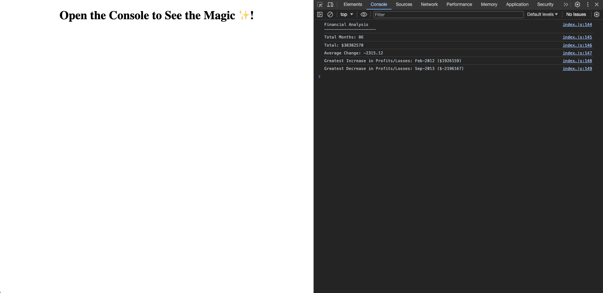

# Console-Finances

## Description

This page was created to display some financial data in the console. The data was calculated using JavaScript.

While working on this project, I learned about the basics of JavaScript. I learned how to use it to run calculations including adding up values contained in a series of arrays within an array, how to calculate an average comparing values and how to get the greatest increase and decrease between compared values.

## Installation
N/A

## Usage

To view the financial analysis, navigate to [Console - Finances](https://naike-b.github.io/Console-Finances/) open the Chrome DevTools by pressing Command+Option+I (MacOS) or Control+Shift+I (Windows). A console panel should open either below or to the side of the Webpage in the browser. 

There you should see the following data: 

Financial Analysis

Total Months: 86 

Total: $38382578

Average Change: -2315.12

Greatest Increase in Profits/Losses: Feb-2012 ($1926159)

Greatest Decrease in Profits/Losses: Sep-2013 ($-2196167)

The total of Months in the period analysed, the total Profit/Losses over the entire period, the total average difference between months as well as the greatest increase and decrease in Profit/Losses and in which month and year it occurred.

## Credits

N/A

## License

Please refer to the LICENSE in the repo.
